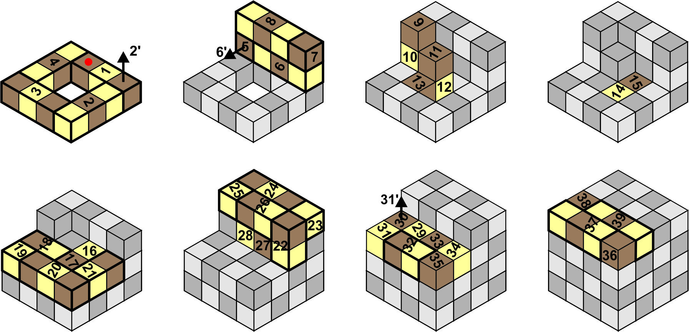

# Snake-cube-puzzle  
Snake cube puzzle solver

## Description of subject:  
There is a 4x4x4 King Snake with the following matrix: [3, 4, 4, 4, 2, 4, 2, 4, 2, 2, 2, 2, 2, 2, 2, 2, 2, 3, 2, 4, 3, 3, 2, 4, 2, 3, 2, 2, 2, 2, 2, 3, 2, 2, 2, 2, 4, 2, 4].  
See Snake_King_Unraveled.jpg for reference.  
  

## To do:  
### End Goal:  
The end goal is to develop a program to solve the puzzle and display the solution in order to solve the puzzle in real life.  
See Snake_King_Solved.jpg and Snake_King_Solution.jpg for reference.  

  

#### Snake King Cube puzzle Algorithm:  
Before I can start writing the program to solve the puzzle I must identify the mathematical algorithm for solving the puzzle.  

>[!Note]
>After an initial search the task seems very complex and therefore I have decided to work on a smaller scope to begin with.  

### Snake Cube Puzzle  
This section is for a smaller 3x3x3 cube.  
As I do not own a 3x3x3 cube I will be using the one described in the following image:
